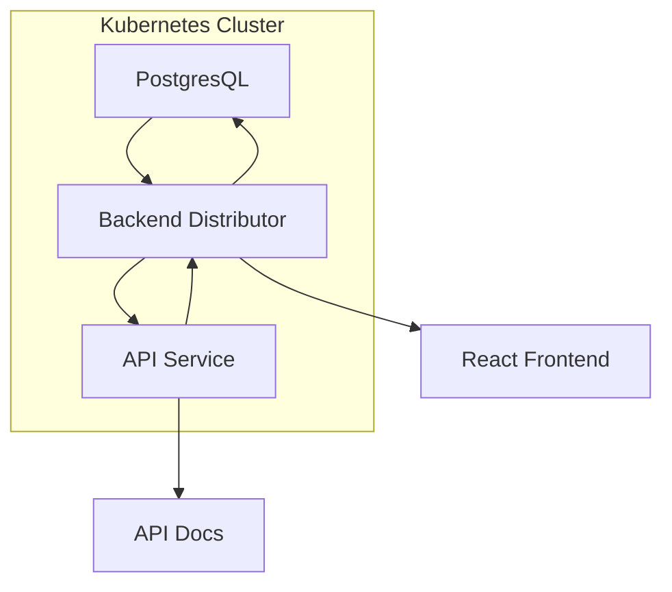

<br>


# Task App
Gathers task across multiple sources so you can be more productive. Tasks app lets users spend less time fetching tasks and more time doing them!

## Features
- Automatically fetch Canvas LMS assignments
- Add new tasks manually via the app UI
- View all tasks and filter by `today` or `all`
- Manage your tasks via the Task App API (`GET`, `PUT`, `POST`, `DELETE` all tasks)

## Application Architecture



## Roadmap
- [ ] Add Google Calendar, MS Outlook configuration
- [ ] Automatically generate tasks from emails
- [ ] Provide a `Terraform Provider` and `Kubernetes Operator` for better automation capability
- [ ] Add better filtering from the UI
- [ ] Allow export to `.csv`, `.txt`, and other options

## How to Contribute
In order to contribute, you need to have `kubectl` installed along with `minikube`. You also need to have `yarn` and `npm` installed along with React. Please follow the steps below:

  **1**. Navigate to the project folder and run the following command to install and build the app:
  ```bash
  cd pkg/app
  yarn start
  ``` 

  **2**. You should now see the app on your local.

  **3**. This is how to get the app running for local developement.

  **4**. In order to work with this app and connect with the backend you need to run the following helm commands from the project folder: 
  ```bash
  cd helm/charts
  helm install taskapp . --set debug=true
  ```

  
